# Upstream Sync Review: openshell-driver-openshift vs NVIDIA/OpenShell

**Date**: 2026-04-27
**Upstream ref**: NVIDIA/OpenShell main (latest commit: f8fb382)
**Fork ref**: zanetworker/openshell-driver-openshift main (latest commit: 7ca6a23)

## Proto Drift

### 1. `ResolveSandboxEndpoint` RPC removed upstream (CRITICAL)

**Upstream PR**: [#867 - feat(server,sandbox): supervisor-initiated SSH connect and exec over gRPC-multiplexed relay](https://github.com/NVIDIA/OpenShell/pull/867)

Your proto includes `ResolveSandboxEndpoint`, `ResolveSandboxEndpointRequest`,
`ResolveSandboxEndpointResponse`, and `SandboxEndpoint` messages (proto lines 42-260).
Upstream removed this RPC entirely in PR #867.

**Why it existed**: The original architecture had the gateway dial sandbox pods
directly for SSH connect and exec. When a user ran `openshell sandbox connect` or
`openshell sandbox exec`, the gateway needed to know the sandbox's IP:port. So it
called `ResolveSandboxEndpoint` on the compute driver, which looked up the pod IP
(or fell back to cluster DNS) and returned an endpoint the gateway could dial. Our
implementation does exactly this: tries the pod IP via `instance_id`, falls back to
`<name>.<namespace>.svc.cluster.local:2222`.

#### Old model (your driver implements this):

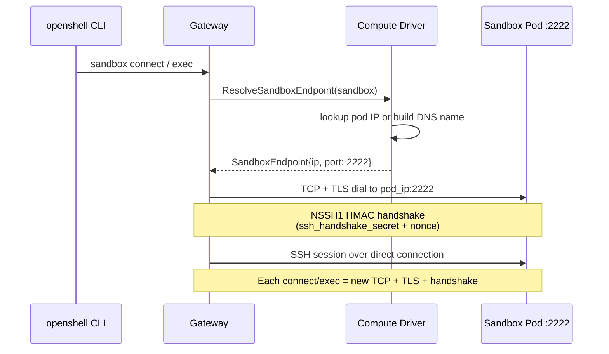

**Why it was removed**: PR #867 introduced a fundamentally different connectivity
model. Instead of the gateway dialing outward to each sandbox, the supervisor inside
the sandbox now initiates a persistent gRPC session back to the gateway
(`ConnectSupervisor`). SSH and exec traffic rides this session as multiplexed
`RelayStream` RPCs on the same HTTP/2 connection. This eliminates the need for the
gateway to resolve sandbox endpoints because the sandbox connects to the gateway,
not the other way around.

#### New model (upstream, post-PR #867):

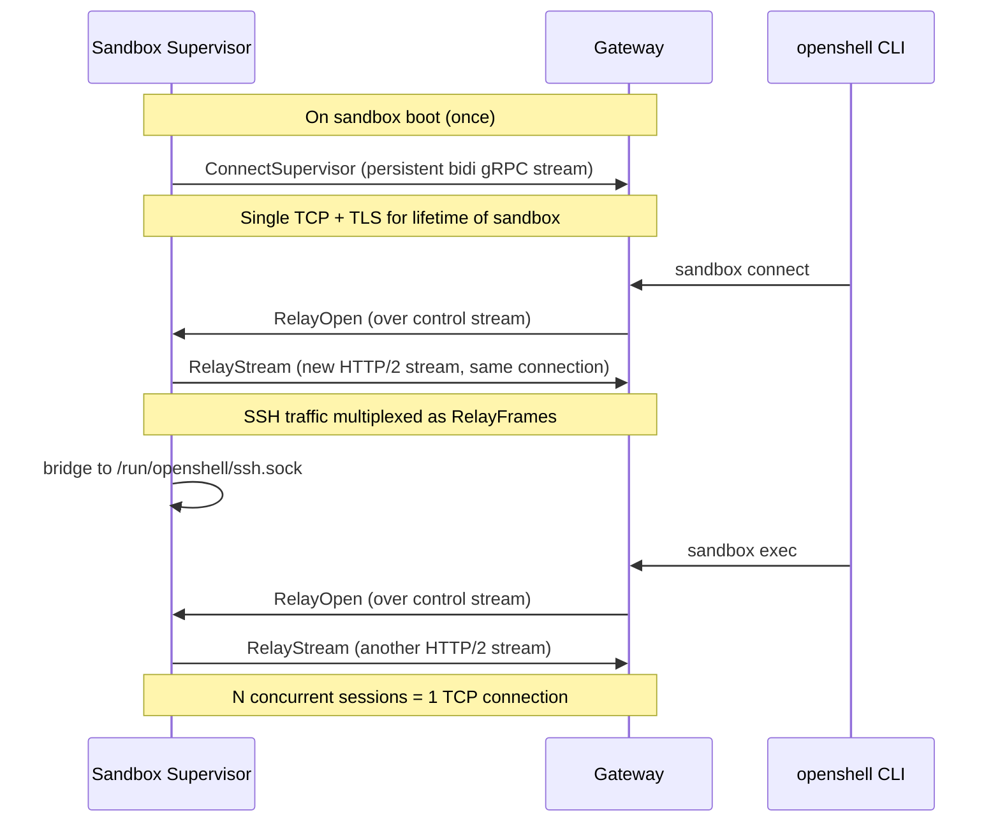

The benefits of this reversal:
- One TLS handshake per sandbox lifetime instead of one per connect/exec
- One TCP connection per sandbox instead of 1+N (53 TCPs in a 50-relay storm dropped to 3)
- No gateway-to-sandbox network path required (simplifies firewalls, LBs, NetworkPolicies)
- SSH daemon moved from port 2222 to a Unix socket (`/run/openshell/ssh.sock`),
  removing the NSSH1 HMAC handshake and nonce replay detection entirely
- The `ssh_handshake_secret` / `ssh_handshake_skew_secs` config fields are now dead
  code upstream (tracked for cleanup in OS-102)

**Upstream proto** (9 RPCs): GetCapabilities, ValidateSandboxCreate, GetSandbox,
ListSandboxes, CreateSandbox, StopSandbox, DeleteSandbox, WatchSandboxes

**Your proto** (10 RPCs): same + ResolveSandboxEndpoint

**Impact**: If the upstream gateway ever calls your driver over UDS, it will never
call `ResolveSandboxEndpoint`. The extra RPC is dead code. Your
`SandboxProvisioner` interface requires `ResolveEndpoint()` which adds unnecessary
complexity. Additionally, your driver still injects `OPENSHELL_SSH_LISTEN_ADDR`
(port 2222) and `OPENSHELL_SSH_HANDSHAKE_SECRET` into sandbox pods, which are no
longer used upstream.

**Action**: Remove `ResolveSandboxEndpoint` from proto, regenerate Go code, remove
from `SandboxProvisioner` interface, remove from `provisioner.go` and `driver.go`.
Also remove the `SSHListenAddr` and `SSHHandshakeSecret` config fields and their
env var injection.

**Files affected**:
- `proto/compute_driver.proto` (lines 42-44, 241-260)
- `gen/computev1/compute_driver.pb.go` (regenerate)
- `gen/computev1/compute_driver_grpc.pb.go` (regenerate)
- `internal/driver/interfaces.go` (line 17)
- `internal/driver/provisioner.go` (lines 204-228, 343-348)
- `internal/driver/driver.go` (lines 196-205)
- `internal/driver/config.go` (lines 12-13)
- `cmd/driver/main.go` (lines 35-38)


## Security Context

### 2. `privileged: true` vs granular capabilities (CRITICAL)

**Upstream PR**: [#817 - refactor(server): extract kubernetes compute driver](https://github.com/NVIDIA/OpenShell/pull/817)
(capabilities were part of the original server code, carried over during extraction)

Your driver sets `"privileged": true` and `"runAsUser": 0` on the agent container
(`provisioner.go:275-278`).

Upstream uses granular Linux capabilities instead:
```json
{
  "capabilities": {
    "add": ["SYS_ADMIN", "NET_ADMIN", "SYS_PTRACE", "SYSLOG"]
  }
}
```

#### What the supervisor actually needs root for:

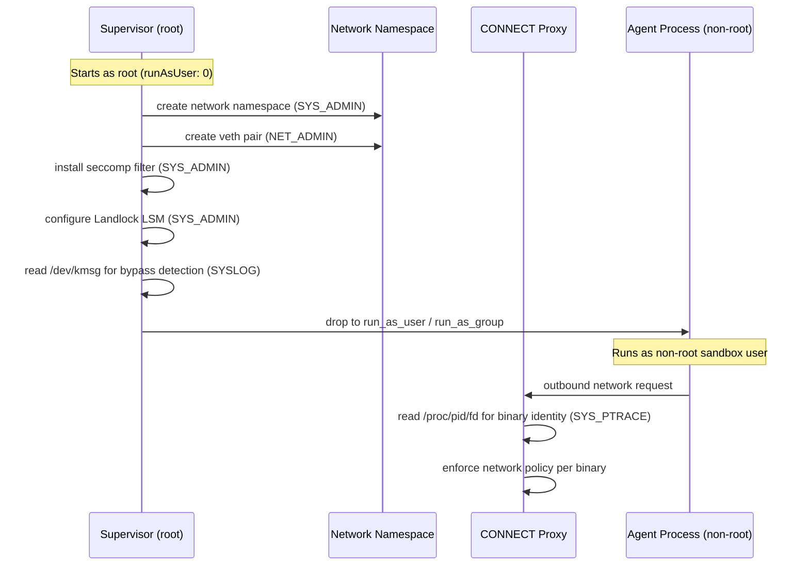

**Why upstream uses these specific capabilities**:
- `SYS_ADMIN`: seccomp filter installation and network namespace creation
- `NET_ADMIN`: network namespace veth setup
- `SYS_PTRACE`: CONNECT proxy reads /proc/pid/fd to resolve binary identity for
  network policy enforcement
- `SYSLOG`: reading /dev/kmsg for bypass detection diagnostics

**Impact**: `privileged: true` grants ALL capabilities plus host device access. On
OpenShift, the `privileged` SCC is required, which is a major security escalation.
With granular capabilities, a custom SCC with just those 4 caps would suffice.

#### OpenShift SCC comparison:

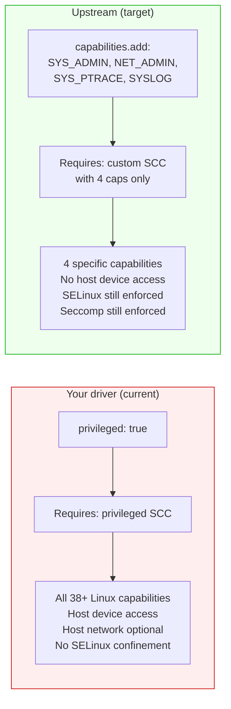

**Action**: Replace privileged security context with capabilities list. Keep
`runAsUser: 0` (the supervisor needs root, then drops privileges for child
processes).

**Files affected**:
- `internal/driver/provisioner.go` (lines 275-278)


## Supervisor Side-Loading

### 3. Init container (yours) vs hostPath (upstream) (INTENTIONAL DIVERGENCE)

**Upstream PR**: [#267 - refactor(sandbox): sandboxes are managed as separate community images](https://github.com/NVIDIA/OpenShell/pull/267)

Upstream (PR #267, merged 2026-03-13) replaced init containers with hostPath volumes.
The supervisor binary is baked into the k3s cluster node image and mounted read-only
via hostPath at `/opt/openshell/bin`.

Your driver uses an init container that copies the supervisor from a container image
(`quay.io/azaalouk/openshell-supervisor:latest`) into an emptyDir shared volume.

#### Upstream (k3s hostPath):

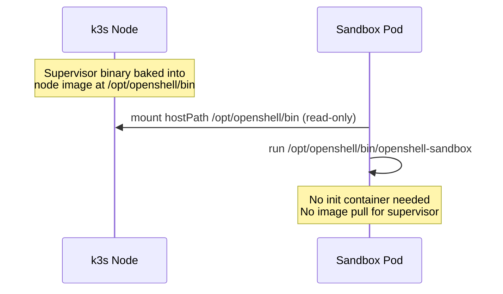

#### Your driver (OpenShift init container):

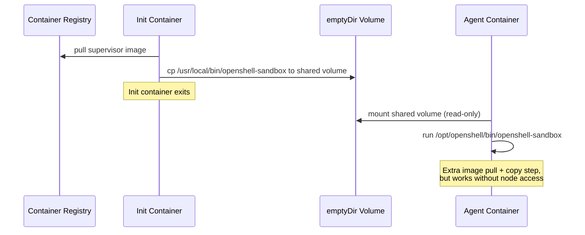

**This divergence is correct for OpenShift.** HostPath volumes are heavily restricted
by OpenShift SCCs (requires `privileged` or a custom SCC with `allowHostDirVolumePlugin`).
The init-container approach works without any node filesystem assumptions and only
needs standard volume permissions. No action needed here.


## Missing Features

### 4. Workspace persistence (PVC) (IMPORTANT)

**Upstream PR**: [#739 - fix(bootstrap,server): persist sandbox state across gateway stop/start cycles](https://github.com/NVIDIA/OpenShell/pull/739)

Upstream added PVC-backed workspace persistence so sandbox data survives pod
rescheduling. Every sandbox gets:
- A `volumeClaimTemplates` entry (2Gi ReadWriteOnce)
- An init container that seeds the PVC from the image's `/sandbox` on first use
- A sentinel file `.workspace-initialized` to skip re-seeding

Your driver has no workspace persistence. Sandbox data is lost on pod restart.

#### Upstream workspace persistence flow:

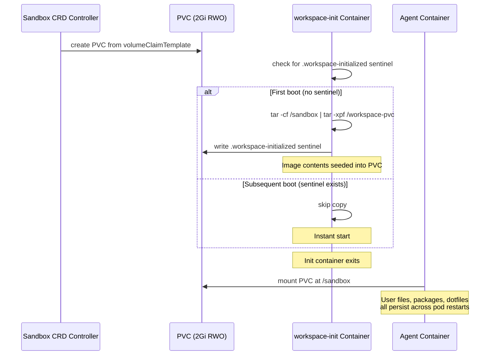

#### Your driver (no persistence):

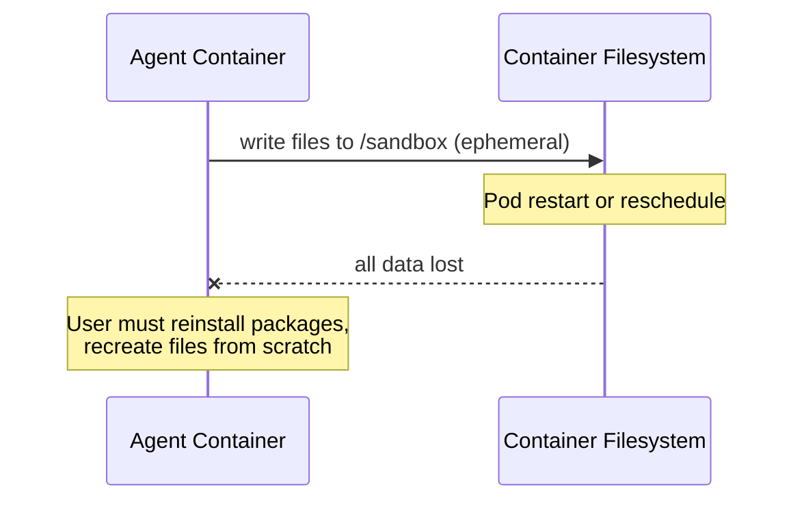

**Upstream code**: `apply_workspace_persistence()` and
`default_workspace_volume_claim_templates()` in `driver.rs`

**Action**: Implement PVC workspace support, or document as a known limitation.


### 5. mTLS support (MODERATE)

**Upstream PR**: [#862 - feat(sandbox): load system CA certificates for upstream TLS connections](https://github.com/NVIDIA/OpenShell/pull/862)
(TLS secret volume mount was part of the k8s driver extraction in [#817](https://github.com/NVIDIA/OpenShell/pull/817))

Upstream injects a `client_tls_secret_name` volume from a Kubernetes Secret for
mTLS between sandbox and gateway. Volume is mounted at `/etc/openshell-tls/client`
with mode 0400. Your driver has no TLS support.

**Action**: Add `ClientTLSSecretName` to Config and inject the volume mount when set.


### 6. Platform event correlation in Watch (MODERATE)

**Upstream PR**: [#817 - refactor(server): extract kubernetes compute driver](https://github.com/NVIDIA/OpenShell/pull/817)

Upstream's `watch_sandboxes` watches both Sandbox CRs AND Kubernetes Events, then
correlates events to sandbox IDs using name/pod indexes. It emits
`WatchSandboxesPlatformEvent` for correlated K8s events (e.g., pod scheduling
failures, image pull errors).

Your Watch only watches Sandbox CRs and emits Updated/Deleted events. The gateway
won't see platform-level events like `FailedScheduling` or `ErrImagePull`.

#### Upstream dual-stream watch:

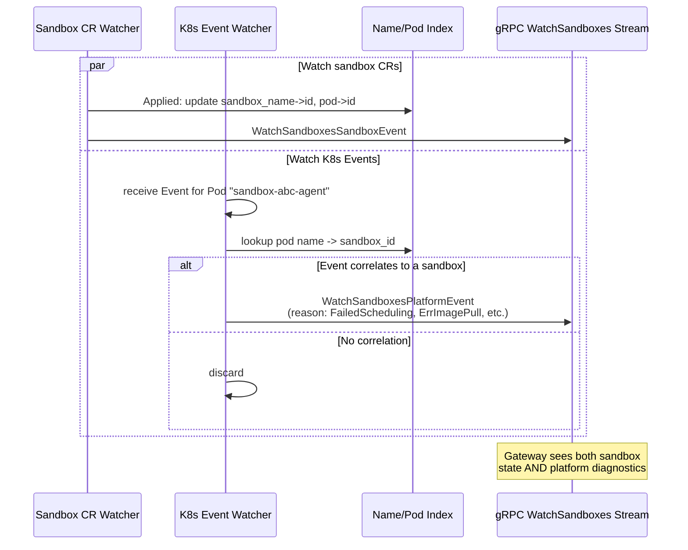

#### Your driver (single-stream watch):

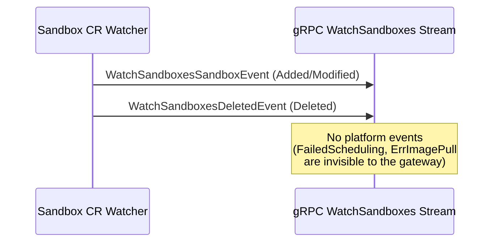

**Action**: Add K8s Event watching and correlation. This is important for
observability, especially on OpenShift where scheduling failures are common
due to SCC restrictions, resource quotas, and node selectors.


### 7. `host_gateway_ip` config (MODERATE)

Upstream's config includes `host_gateway_ip` for network routing. Your config
doesn't have this.

**Action**: Add to Config if needed for your deployment topology.


### 8. `image_pull_policy` config (MINOR)

Upstream passes `image_pull_policy` through to all containers (agent and init).
Your driver hardcodes no pull policy, defaulting to Kubernetes's standard behavior
(Always for :latest, IfNotPresent otherwise).

**Action**: Add `ImagePullPolicy` to Config.


## Behavioral Differences

### 9. `StopSandbox` implementation (MINOR)

**Upstream PR**: [#817 - refactor(server): extract kubernetes compute driver](https://github.com/NVIDIA/OpenShell/pull/817)

Your driver delegates `StopSandbox` to `Delete` (deletes the CR). Upstream returns
`Status::unimplemented` since stopping without deleting is not supported by the
Kubernetes driver.

**Action**: Return `codes.Unimplemented` instead of delegating to Delete.

**Files affected**:
- `internal/driver/driver.go` (lines 171-180)


### 10. API call timeouts (MINOR)

**Upstream PR**: [#907 - fix(k8s-driver): use dedicated kube client without read_timeout for watches](https://github.com/NVIDIA/OpenShell/pull/907)

Upstream wraps every K8s API call in a 30-second `tokio::time::timeout` and uses a
dedicated kube client without `read_timeout` for long-lived watch streams. Your
driver relies on gRPC context deadlines without explicit K8s API timeouts.

**Action**: Consider adding `context.WithTimeout` wrappers around K8s API calls in
the provisioner.


## Hardcoded Values to Review

| Value | Location | Issue |
|-------|----------|-------|
| `quay.io/azaalouk/openshell-supervisor:latest` | `config.go:22` | Personal image registry |
| `openshell-system` | `config.go:20` | Default namespace, upstream is configurable |
| `OPENSHELL_SANDBOX_COMMAND=sleep infinity` | `provisioner.go:337` | Not set upstream |
| `kagenti.io/type: agent` label | `provisioner.go:28,78` | Not present upstream |
| `serviceAccountName: openshell-sandbox` | `provisioner.go:295` | Hardcoded, should be configurable |
| `ANTHROPIC_BASE_URL=https://inference.local/v1` | `provisioner.go:355` | Your addition for inference routing |
| `OPENAI_BASE_URL=https://inference.local/v1` | `provisioner.go:356` | Your addition for inference routing |


## Appendix: Full Connection Architecture (Upstream Post-PR #867)

This section explains how a user's terminal ends up connected to a process
inside a sandbox pod, end to end.

### The three planes

The new architecture separates concerns into three planes, all multiplexed
over a single TCP+TLS connection per sandbox:

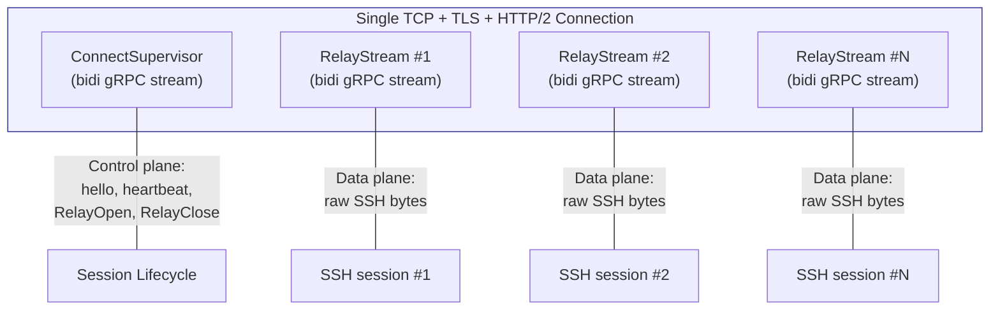

### End-to-end: `openshell sandbox connect`

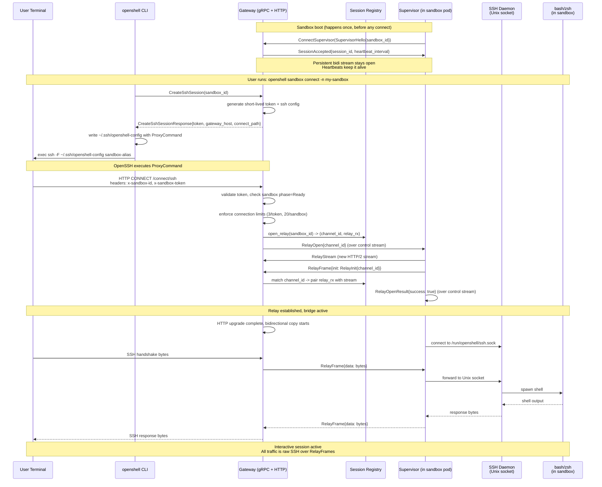

### End-to-end: `openshell sandbox exec`

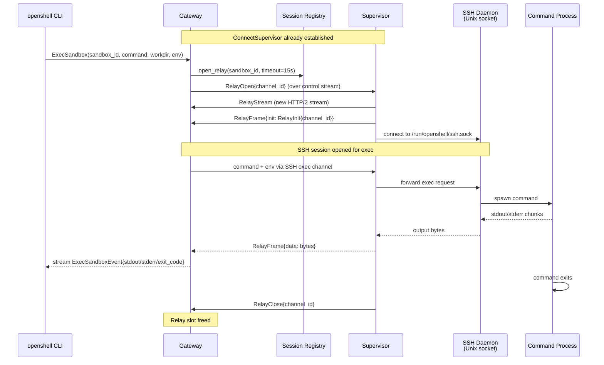

### Why this matters for the OpenShift driver

The compute driver (your code) is not involved in any of this connection flow.
The driver's job ends after `CreateSandbox` and `WatchSandboxes`. The connection
path is entirely between the supervisor (running inside the sandbox pod) and the
gateway. This is why `ResolveSandboxEndpoint` was removed from the driver proto:
the driver never needs to tell the gateway how to reach the sandbox, because the
sandbox reaches the gateway instead.

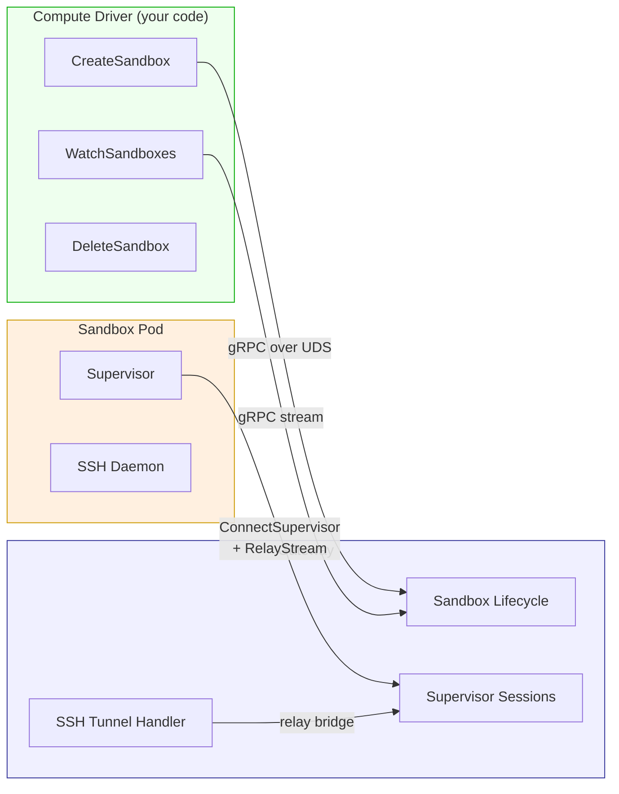


## Priority Order

1. **Proto sync**: Remove `ResolveSandboxEndpoint` and regenerate (breaking change, dead code)
2. **Security context**: Switch from `privileged: true` to granular capabilities
3. **StopSandbox**: Return Unimplemented instead of Delete
4. **Workspace persistence**: Add PVC support (feature gap)
5. **Platform event correlation**: Add K8s Event watching
6. **mTLS**: Add client TLS secret support
7. **Config cleanup**: Add ImagePullPolicy, make ServiceAccountName configurable
